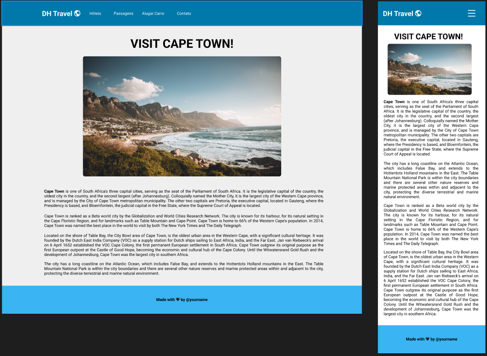

# dh-travel

## Objetivo da aula
O objetivo desta aula é entender e praticar sobre:

- Modelos de caixa
  - Width
  - Height
  - Padding
  - Border
  - Margin
  - Box sizing
  
- Elementos de linha e bloco
- Medidas relativas
  - Pixel
  - %
  - Em
  - Rem
  - Viewport

- *Media queries*

## Atividade
Criar o repositório `dh-travel` e desenvolver a página que o designer enviou.

**Figma da atividade:** https://www.figma.com/file/dLjw0dNVNzihmoNZ1LZrbr/DH-Travel?node-id=0%3A1

**Paleta de Cores**: https://colorhunt.co/palette/0078aa3ab4f2f2df3af6f6f6

**Fonts**: https://fonts.google.com

**Icons**: https://fonts.google.com/icons

## Estudos complementares

- [w3Schools - HTML](https://www.w3schools.com/html/default.asp)
- [w3Schools - CSS](https://www.w3schools.com/css/default.asp)

- [MDN - HTML](https://www.w3schools.com/html/default.asp)
- [MDN - CSS](https://developer.mozilla.org/pt-BR/docs/Web/CSS)
- [CSS Diner - Game](https://flukeout.github.io/)
